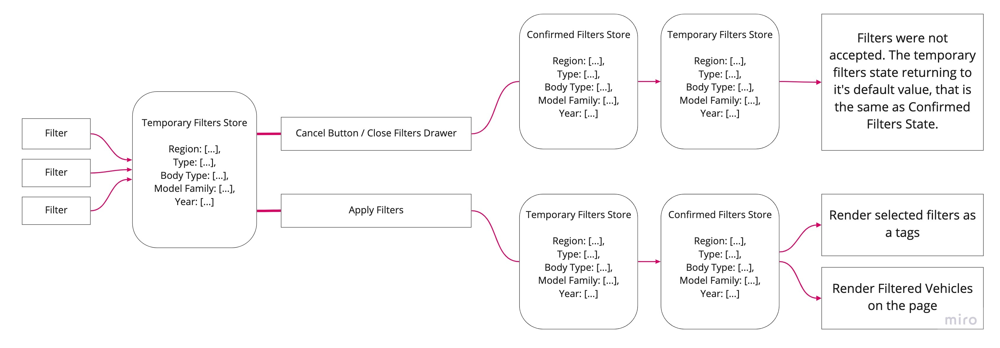

# Full project structure

## Backend + Frontend structure

Here is the full picture how this project is working and how BE connected with FE with all related services and some other project (VLP and VDP):

## FE project structure

Let's take a look at the global structure tree. This diagram shows which components are parents and which child to each other:

## Filters Structure

Another important part of the project logic is how filters work.  
First of all, I would like to note that Redux is actively involved in the project. To implement competently dynamic logic for filters, two reducers exist - **temporary filters reducer** and **confirmed filters reducer**  
When the user enters the page, he has 2 default filter values ​​- National offers and New vehicle type. When the user starts selecting filters, they go into a temporary filters reducer to dynamically filter and show which following filters will be available and the number of cars available based on the selected criteria.  
If the user confirms his choice with the corresponding button, the selected filters automatically fall on the permanent filters of the reducer. Based on the filters that are there, all cars are filtered and on the page, we see the final cars.  
If the user, for some reason, closes the drawer filter, then the temporary filters are reset to their original value (the initial value corresponds to permanent filters). That is, if the user has previously applied some filters, then they will be the starting point during the next opening of the filter window.

Here is visual diagram of what it looks like

Filters have their hierarchy, and work as a funnel - each lower filter depends on the one above. That is, for example, if the user has selected the body type of SUV, then he will see only those models that correspond to this body. After that, the user can choose the year of issue, the options for which will be shown based on the previously selected filters.  
An important clarification - only National filters are available for CPO cars. The user cannot select Montreal offers and then CPO vehicles.  
Below is a diagram of what a filter funnel looks like.

## Order Structure

Another important topic is the order in which cars are displayed on the screen.  
First of all, New Vehicles are shown on the screen, and after them there are always CPO ones.  
Let's take a look on NEW Vehicles block - Region Offers are displayed first of all, and at the very end National ones. Region are displayed in the order in which the user selected them. If the user has chosen in order - Vancouver, Montreal, National, Toronto - then on the screen we will see the following sequence - Vancouver, Montreal, Toronto, National (as we remember, the national is ALWAYS at the bottom).  
Within each regional block, cars are displayed in a certain order, starting with A3 and ending with R8.  
If somehow the offer is Featured, then it will be located at the top of its region block. An example can be seen in the diagram below.

As for CPO vehicles, they have their own sequence, based on the year of manufacture. First of all, we will see the most recent years of one model range, when the oldest is reached - the next model of the most recent year will be next. For example, the order will look like this - 2020 A3 Sedan, 2020 A3 Convertible, 2019 A3 Sedan, 2019 A3 Convertible, 2018 A3 Sedan, ..., 2020 A4 Sedan, 2019 A4 Sedan, and so on.

Let's have a look how it will look like on diagram.

